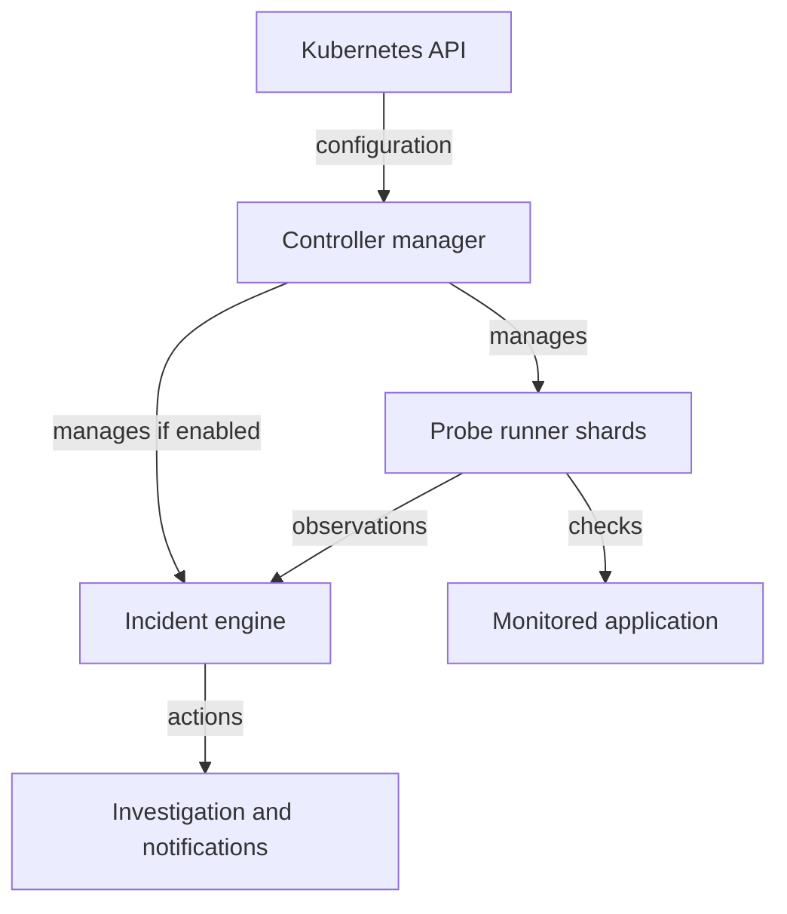
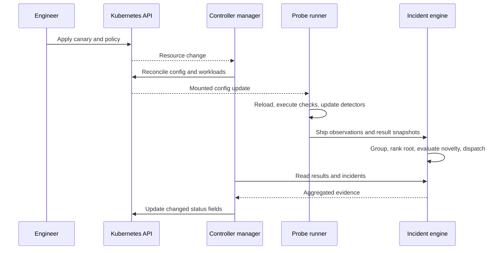

# Understand the components

Before deploying anything, separate desired state from repeated work. A canary describes a contract; the operator arranges for a runner to execute it. Adding intelligence introduces a third process that considers observations from multiple checks.

| Process | Input | Responsibility | Evidence to inspect |
| --- | --- | --- | --- |
| Controller manager | Canary and policy resources | Reconcile shared infrastructure and configuration; project meaningful result changes into status | Kubernetes objects, controller logs, CR status |
| Probe runner | Rendered probe configuration and credentials | Execute protocol assertions; calculate enabled body drift and latency signals | Live results, sample counts, scores, runner logs |
| Incident engine | Runner observations and policy configuration | Aggregate results, correlate failures, rank a suspected root, classify novelty, dispatch actions | Incidents, merge evidence, action payloads |

The incident engine is deployed only when a canary uses intelligence. The controller manages the runner StatefulSet and the optional engine Deployment. Installing the operator does not mean the learner should also hand-maintain those runtime resources: reconciliation can overwrite competing manual edits.

## Follow a configuration change

The controller owns Kubernetes updates. Runners execute requests; the engine aggregates their evidence. Both result paths end at the status syncer, which projects the applicable live view into the API.

You submit a canary to the Kubernetes API. Schema validation checks its structure. The controller lists the desired probes and policies and reconciles shared ConfigMaps, authentication configuration, workloads, and Services. Runners reload configuration and execute checks at their configured intervals. A background status syncer reads live results and incidents and updates the custom resource when meaningful fields change.

This is asynchronous. A successful `kubectl apply` means Kubernetes accepted the object, not that the target has already been checked. After changing an assertion, inspect a result that actually evaluated the new assertion. An old healthy message is not proof that your new configuration passed.

## Four decisions that must not be confused

1. **Protocol validation:** status, text, journey, MCP, or gRPC assertions decide whether the check passed.
2. **Passing-response analysis:** Potion compares body meaning against a learned baseline. A response can satisfy its explicit contract and still drift. Latency uses a local statistical baseline and does not use embeddings.
3. **Failure grouping:** declared topology or sufficient same-space MiniLM similarity can merge eligible failures. A declared edge does not require successful embedding. Similarity is evidence of a shared failure shape, not proof of a shared physical cause.
4. **Investigation and notification:** root ranking and novelty affect what an incident reports and whether an expensive investigation runs. A known failure can still generate notifications. Drift and latency must not be labeled nonnovel when novelty was never evaluated.

Potion uses 512-dimensional static embeddings in the runner. MiniLM uses 384-dimensional transformer embeddings through ONNX Runtime in the engine. Their coordinates have different meanings; comparing vectors across these spaces is invalid even if their dimensions were equal.

## State and freshness

The sequence shows an intelligence-enabled installation. Without an engine, the controller collects results from runners. Configuration propagation and status projection are asynchronous; intervals and warmup make each checkpoint necessary.

Runner restart loses drift and latency baselines. Engine restart loses in-memory incidents, novelty clusters, aggregated history, and proposed topology. These components currently do not provide durable highly available model state.

CR status is a persisted summary. Unchanged healthy checks do not force a new status write, so its timestamp can be older than the latest live result. Always check live freshness when investigating missing or stale evidence. The current API does not automatically mark every missing partial-shard result `Unknown`.

Checkpoint: explain why an HTTP 200 response can raise a drift incident, why an engine restart can make an old failure appear new, and why editing the generated runner StatefulSet is not a durable way to configure a canary.
