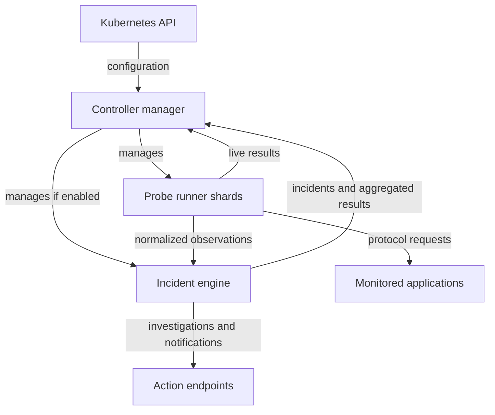

# Pulse Architecture

## Overview

Pulse is a Kubernetes operator that lets developers define HTTP, journey, MCP-over-HTTP, and gRPC canary checks as custom resources. The **controller** manages desired state, sharded **probe runners** execute checks and hot-path detection, and an optional **incident engine** performs cluster-wide correlation and actions.

## Components

The controller owns Kubernetes updates. Runners execute requests and retain
response bodies locally; only normalized detector and failure evidence crosses
into the optional engine. The engine aggregates that evidence and dispatches
configured actions. Both result paths return to the status syncer, which
projects meaningful changes into custom-resource status.

## Data Flow

1. Developer applies an `HttpCanary` CR to any namespace
2. API server validates it against the CRD's OpenAPI schema
3. The informer notifies the controller; all events map to a single reconcile key
4. `HttpCanaryReconciler` lists all CRs, builds a `ProbeConfig`, and writes it to a ConfigMap
5. The reconciler ensures the probe runner StatefulSet and Services exist, plus the incident engine when intelligence is enabled
6. The probe runner reads the ConfigMap (mounted as a volume), detects changes via file watcher
7. The runner executes HTTP checks per probe on their configured interval
8. `StatusSyncer` (a background Runnable) polls the runner's `/results` endpoint every 15s
9. Changed results are written back to each CR's `.status` subresource
10. `kubectl get httpcanaries` shows URL, Phase (Healthy/Unhealthy), and Age

## Component Responsibilities

### Controller Manager (`cmd/main.go`)

The operator binary. Hosts the reconciler and status syncer within a controller-runtime Manager. The Manager provides:
- Shared informer cache (avoids redundant API server watches)
- Leader election (single active instance in HA deployments)
- Health/readiness probes
- Metrics endpoint
- Graceful shutdown

### CanaryReconciler (`internal/controller/canary_controller.go`)

Triggered by canary and policy changes. Manages the shared runtime resources:

| Resource | Name | Purpose |
|----------|------|---------|
| ConfigMap | `pulse-probe-config` | Probe configuration consumed by the runner |
| StatefulSet | `pulse-probe-runner` | Runs one or more stable, hash-sharded probe runners |
| Service | `pulse-probe-runner` | Stable DNS for the controller to reach `/results` |
| Headless Service | `pulse-probe-runner-headless` | Lets status collection address every runner ordinal |
| Deployment | `pulse-incident-engine` | Optional cluster-wide correlation, novelty, and actions |
| Service | `pulse-incident-engine` | Aggregated results and incident APIs |

All CR events are mapped to a single work queue key via `EnqueueRequestsFromMapFunc`. This ensures one reconcile per batch of changes regardless of how many CRs changed.

### StatusSyncer (`internal/controller/status_syncer.go`)

A `manager.Runnable` that runs as a background goroutine. On a 15-second interval:
1. Fetches a complete `GET /results` view from the engine or every runner shard
2. Lists all HttpCanary and GrpcCanary CRs
3. Updates `.status` only for CRs whose state changed

This separation avoids the N-squared scaling problem of polling inside Reconcile with RequeueAfter.

### Probe Runner (`cmd/proberunner/main.go`, `internal/proberunner/`)

A standalone binary deployed by the controller. Responsibilities:
- Read probe config from a YAML file
- Watch for config file changes (5-second poll)
- Execute HTTP checks on per-probe intervals
- Store results in a thread-safe in-memory map
- Serve `/results` (JSON), `/metrics` (Prometheus), `/healthz` (liveness)

## Key Design Decisions

| Decision | Rationale |
|----------|-----------|
| Separate probe runner process | Failure isolation, horizontal scaling, no operator bottleneck |
| ConfigMap for probe config | Native volume mount, automatic propagation, no custom API needed |
| Single reconcile key | O(1) reconciles per event batch instead of O(n) |
| StatusSyncer as Runnable | O(n) status writes per interval instead of O(n^2) |
| Status subresource | Users can't overwrite controller-managed status fields |
| File watcher (not pod restart) | Config updates without downtime or result loss |

## Namespace Model

- HttpCanary and GrpcCanary CRs can live in **any namespace**
- Infrastructure resources (ConfigMap, Secret, StatefulSet, Deployments, Services) live in the **operator namespace** (`pulse-system`)
- The controller lists CRs cluster-wide (requires ClusterRole, not namespaced Role)
- OwnerReferences are not used across namespaces (Kubernetes limitation)
